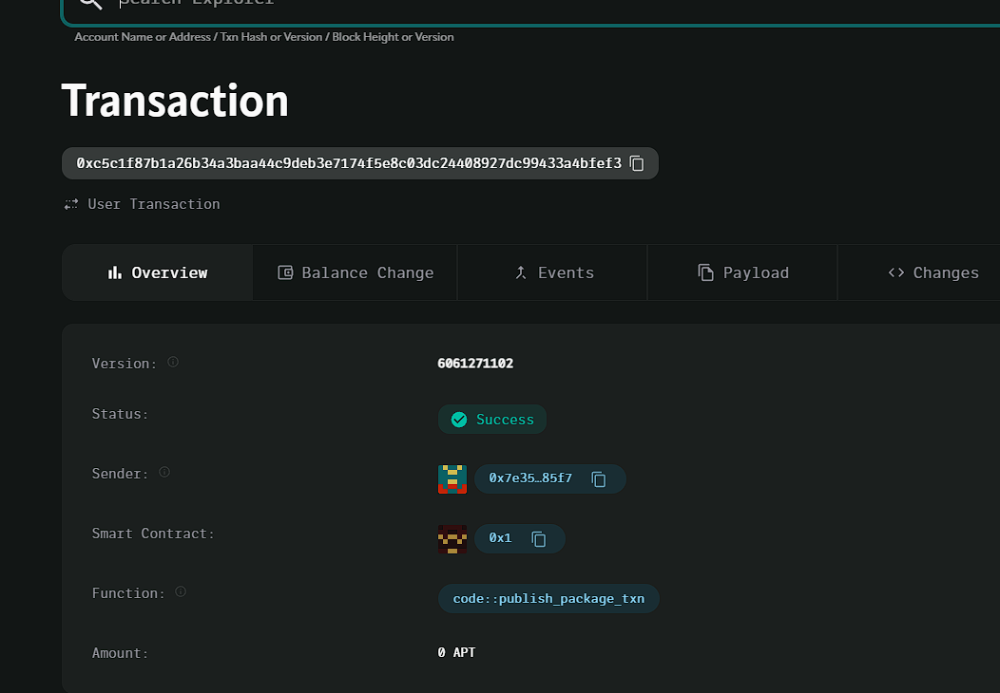

### Deployed smartcontract address: 0xc5c1f87b1a26b34a3baa44c9deb3e7174f5e8c03dc24408927dc99433a4bfef3

### Screenshot: 

# Tokenized Rewards Platform

## Project Description
The Tokenized Rewards Platform allows users to earn tokens by completing certain actions, such as engaging with content or achieving milestones. The system tracks rewards and deposits them into user accounts.

## Vision
To provide an engaging and decentralized platform where users are incentivized to participate in various actions and are rewarded with tokens that have real value within the ecosystem.

## Key Features
- **Tokenized Rewards**: Users earn tokens for completing tasks or achieving milestones.
- **Reward Tracking**: Keeps track of the total rewards accumulated by a user.
- **Easy Integration**: Simple contract functions to reward and track users.

## Future Scope
- **Milestone-Based Rewards**: Integrate specific milestones where users can earn higher rewards.
- **Engagement Tracking**: Implement more sophisticated methods to track user engagement.
- **Reward Redemption**: Allow users to redeem their rewards for goods or services.
